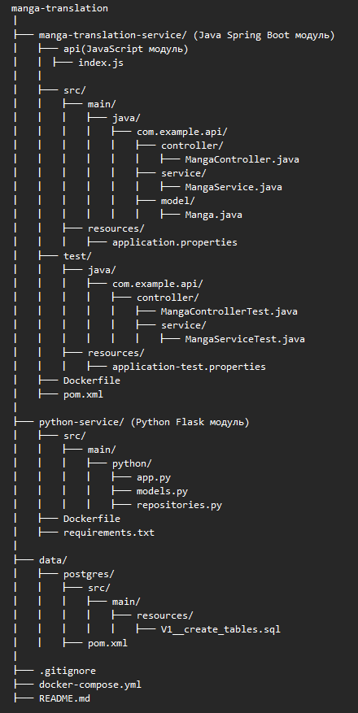
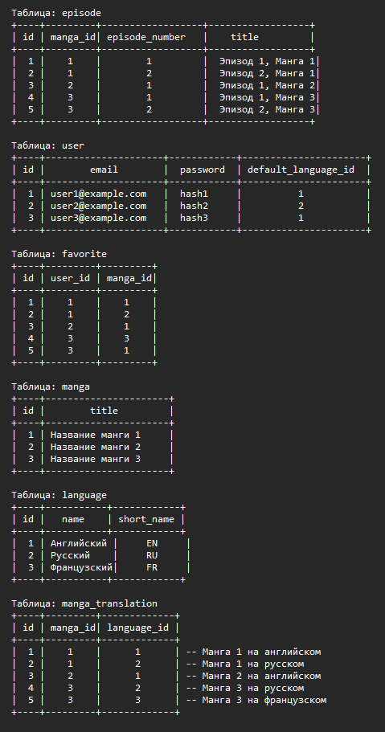

# About project #

## About technology ##

**1.1. Modules**
java-service: Java module using Spring Boot.
python-service: Python module using Flask.
data: Module for working with the database.

**1.2. Docker and Docker Compose**
Dockerfile: Each module has its own Dockerfile for creating Docker images.
docker-compose.yml: File to run all services in containers.

**1.3. Amazon S3 (S3)**
Image Storage: S3 can be used for storing manga images. This allows efficient management of a large volume of images.

**1.4. Redis**
Caching: Redis can be used for caching queries and improving performance. For example, query results from the database can be cached in Redis.

**1.5. RabbitMQ**
Messaging: RabbitMQ is utilized for message queuing between modules. It facilitates communication between the Java and Python services.

## User Flow: Manga Translation App ##

**1.User Registration:**
The user registers on the Manga Translation App.
During registration, the user provides an email and sets a password.

**2.Logging In:**
After registration, the user logs in using their email and password.

3.Managing Profile:
The user manages their profile settings, including the default language for manga translations.

**4.Browsing Manga:**
The user browses available manga titles in the application.
Each manga title has a list of episodes and available translation languages.

**5.Reading Manga:**
The user selects a manga title and episode to read.
The original manga, stored in Amazon S3, is retrieved and displayed.

**6.Translation Request:**
The user requests translation for a different language.
The translation request is sent to the python-service module via RabbitMQ.

**7.Python Service Processing:**
The python-service module processes the translation request.
It interacts with the translation service to translate text content.
The translated text is combined with manga images.

**8.Storing Translated Manga:**
The translated manga is stored in Amazon S3.
Metadata about the translation is stored in the database.

**9.Caching Translation Results:**
Translation results are cached in Redis for improved performance.
Cached results are used to quickly serve previously translated content.

**10.User Favorites:**
Users mark manga titles as favorites.
Favorite information is stored in the database.


## Project Structure ##



## Database Structure example ##



## Docker-compose.yaml example ##

````
version: '3'
services:
manga-translation-service:
build:
context: ./manga-translation-service
ports:
- "8080:8080"
depends_on:
- postgres
environment:
SPRING_DATASOURCE_URL: jdbc:postgresql://postgres:5432/manga_translation
SPRING_DATASOURCE_USERNAME: your_db_username
SPRING_DATASOURCE_PASSWORD: your_db_password

python-service:
build:
context: ./python-service
ports:
- "5000:5000"
depends_on:
- manga-translation-service
- postgres
environment:
MANGA_TRANSLATION_DB_URL: jdbc:postgresql://postgres:5432/manga_translation
MANGA_TRANSLATION_DB_USERNAME: your_db_username
MANGA_TRANSLATION_DB_PASSWORD: your_db_password

postgres:
image: postgres:latest
environment:
POSTGRES_DB: manga_translation
POSTGRES_USER: your_db_username
POSTGRES_PASSWORD: your_db_password
ports:
- "5432:5432"


